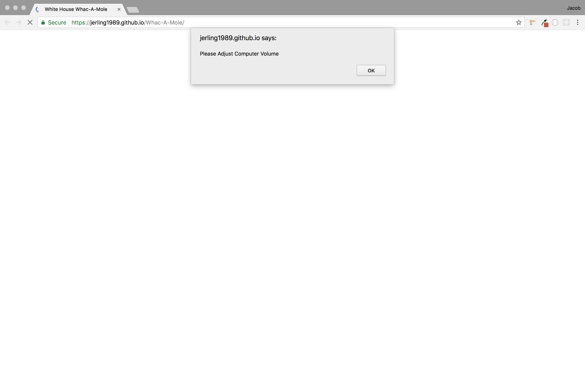
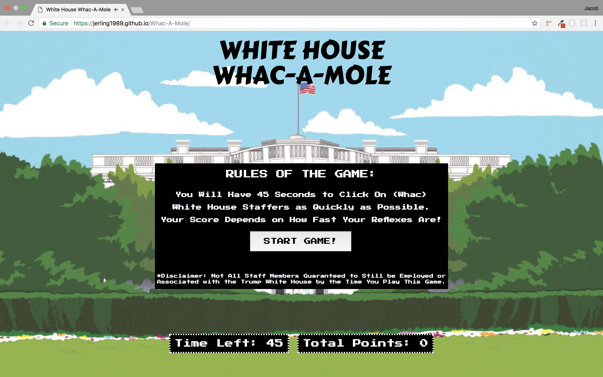
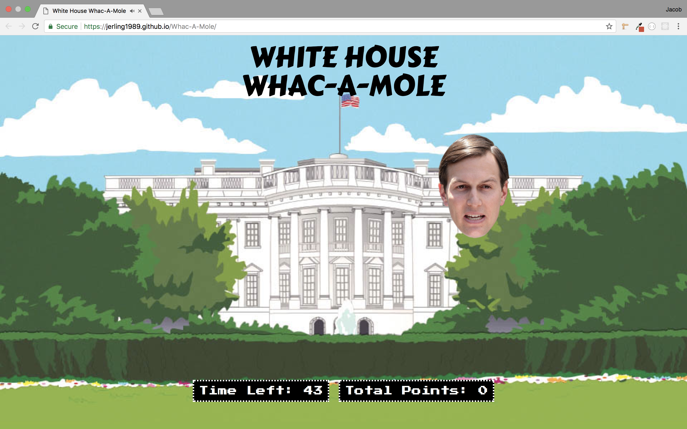
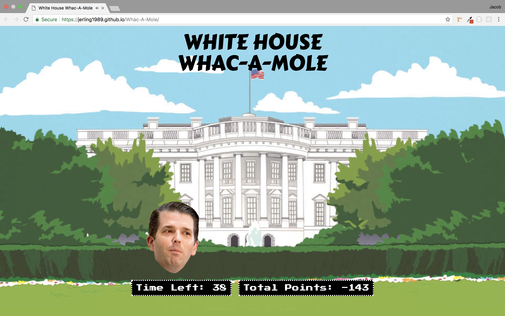
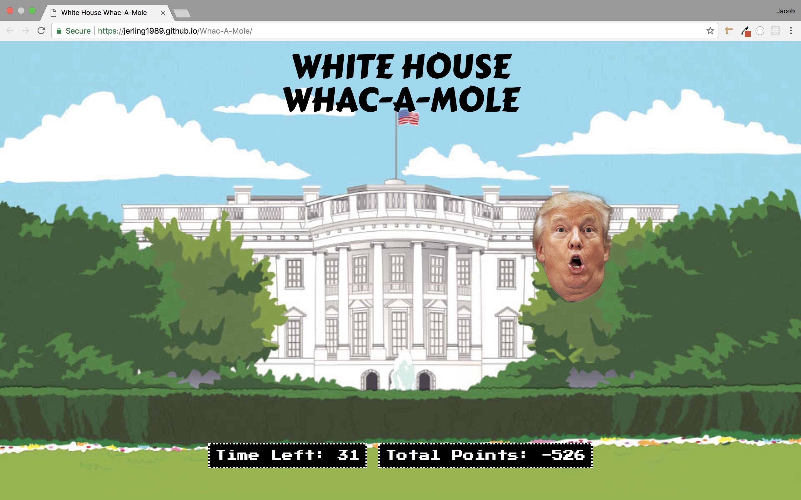
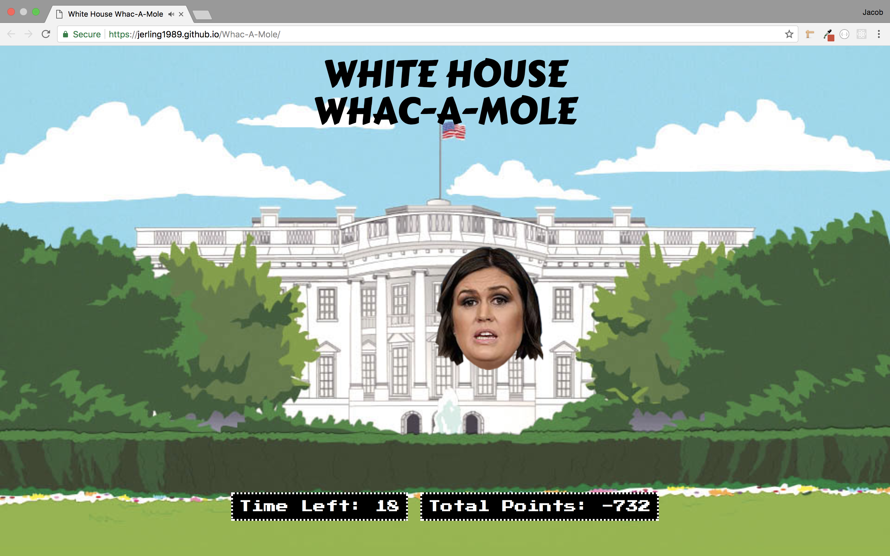
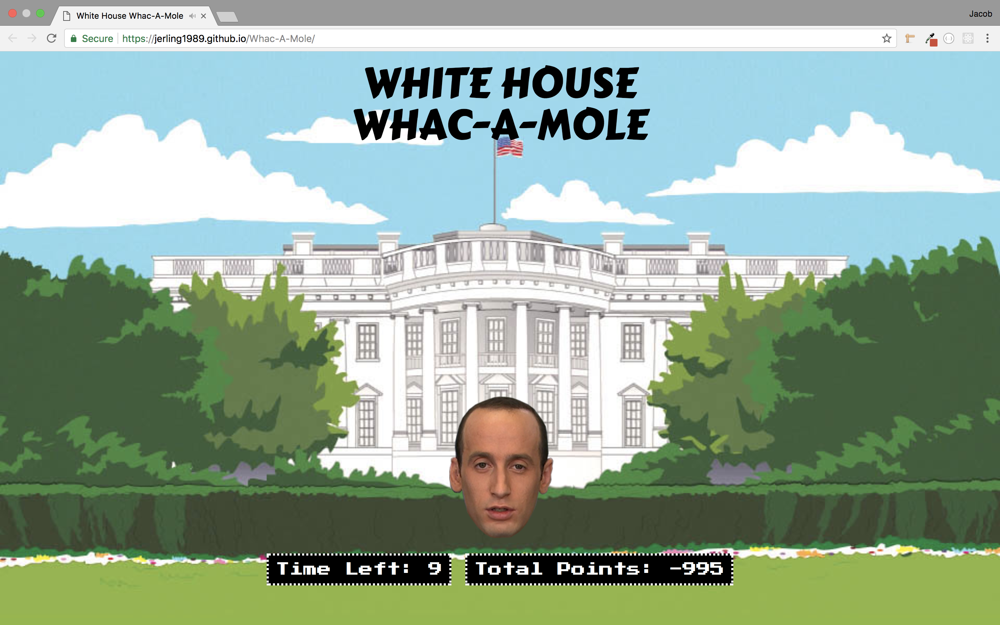
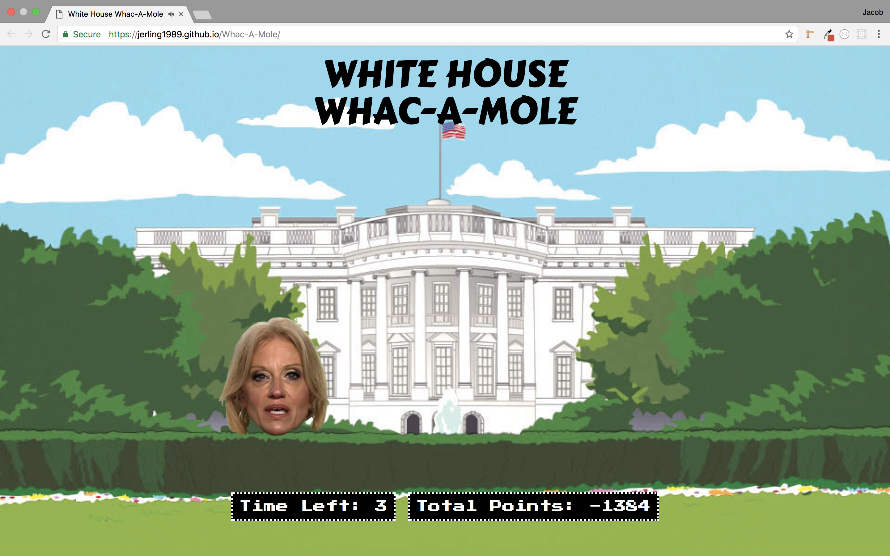
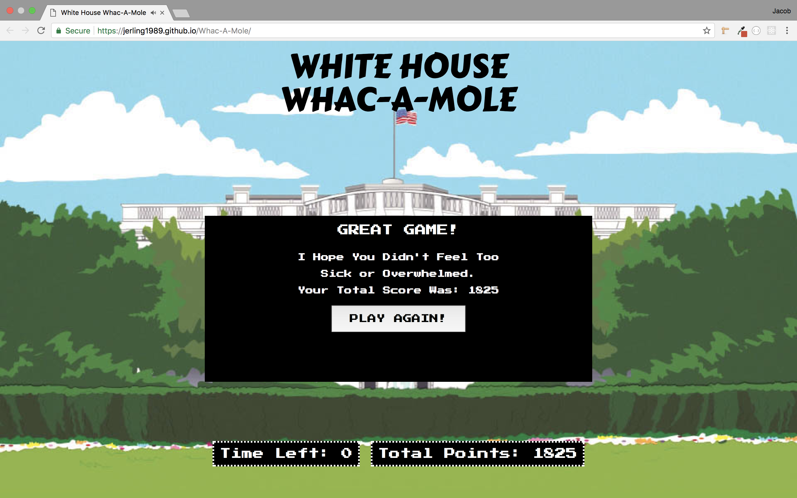

# Whac-A-Mole
Here is a game I made with HTML, CSS, and plain JavaScript. This game was made with the intention of creating a simple game with some humor added to it. It is not a political statement, may someone find themselves offended. The game is "White House Whac-A-Mole" where White House staff members randomly display on the screen and the user scores points by how quickly they click on them.

- The first thing the user will see is an alert box I setup to make them aware that the game does have sound effects. This way they can adjust their computer volume accordingly before being bombarded with sound.

- Once the game launches the user will see a black display card with the instructions of the game and a start button.

- Here is a example of one of the "Moles" that randomly displays, Jared Kushner AKA "Tha Kush God".

- Donald Trump Junior

- The man himself... DJT

- Press Secratary (at the moment) Sarah Huckabee Sanders.

- Everyones favorite reptilian Stephen Miller.

- And finally Kellyanne Conway, the Alternative Facts procurer herself.

- Lastly the user will see this final End Game card pop up once thier 45 second timer is up. They are presented with their final score and a button to start the game over and play again.

